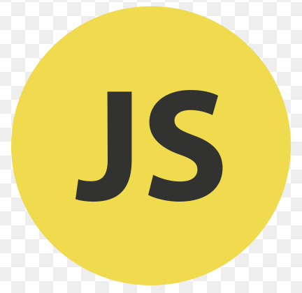
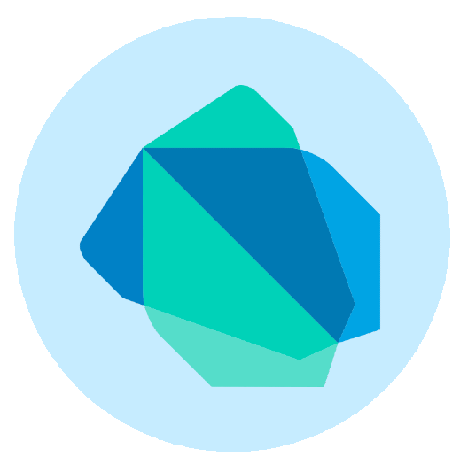
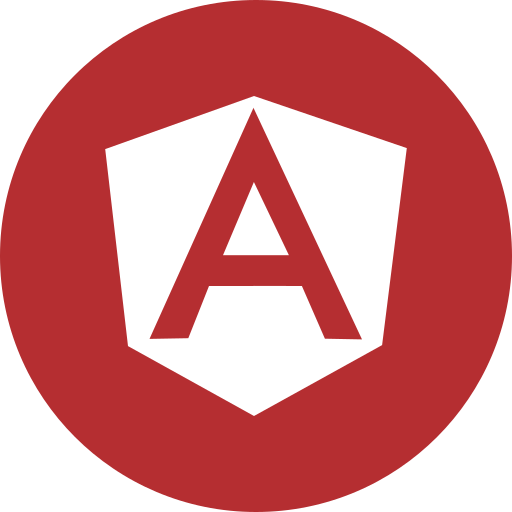
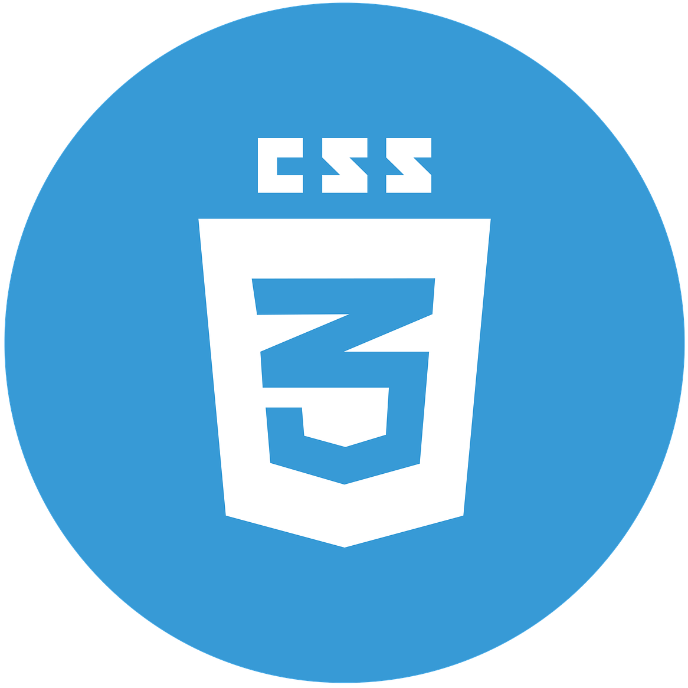
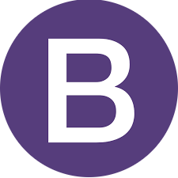

    
    
    
    

 

 

    
    
    
    

I'm a Software Engineer from *Kolkata*. Looking forward to emerge as a **FullStack** Developer.

- 🏢 Currently working in [Cognizant](https://www.cognizant.com/) as a *Jr. Product Specialist*.
- 🎓 Completed my Bachelors in *CS* from [Techno India University](https://www.technoindiauniversity.ac.in/).
- 🏫 Went to [Midnapore Collegiate School](http://midnaporecollegiateschool.org.in).

> I'm a passionate developer, want to contribute to open source, and make friends while doing so! 😇

 

 

    
    
    
    

I'm focusing on increasing my knowledge in *Microservices* architecture. Learning about various CI/CD tools and methods, and also getting invested in **Cloud**.

### ⌨️ Languages I code

 

  
  
  
  

 

### ✨ Frameworks I know

 

  
  
  

 

### 🎨 Libraries I use for styling

 

  
  
  
  

 

### 🛠️ Tools I use to build stuff

 

 Wrote my first `Hello, World!` in *Itellj IDEA* and never looked back.

 May sound weird but I prefer *WebStorm* over *VSCode*.

 Use *Android Studio* for casual Flutter development;

 Use *VSCode* for viewing projects quickly.

 Started with *Windows*. Then switched to *Ubuntu*. That was my first introduction to Linux. Finally found out about **Deepin**, and I instantly fell in love with it. And don't have plans to hop any time soon. 😌

 

> I've an *Ideapad* 100 from Lenovo. With a dual core 5000u processor. I've upgraded my RAM to 8GB, and replaced the HDD with a *Samsung 850 EVO* SSD, and put the hard disk in the disk drive caddy. This trusty guy is serving me for 6 years and counting. 🥰

 

 

    
    
    
    

- [x] ☕ Programming while drinking **Bournvita** is the ultimate fun for me. 
- [x] 🚲 Cycling is my favorite sport. Rebuilt my 10 years old *Hero Ranger* recently. Have great memories with it. 
- [x] 🍿 Sucker for thriller movies. Big fan of **Natalie Portman**. 😍
- [x] ♻️ Love to recycle stuff, specially electronics.
- [x] 😏 And of course smug smiling with my girlfriend [Shuktika](https://github.com/Shuktika15) who made a valuable contribution in making this README. Love you as always sweetie. 😘

 

 

    
    
    
    

  
  
  
  

 

  
I'll be waiting for a <b>Hi</b>.

  

      
      
  

 

 

    
    
    
    

 

 

  
  
  
  

